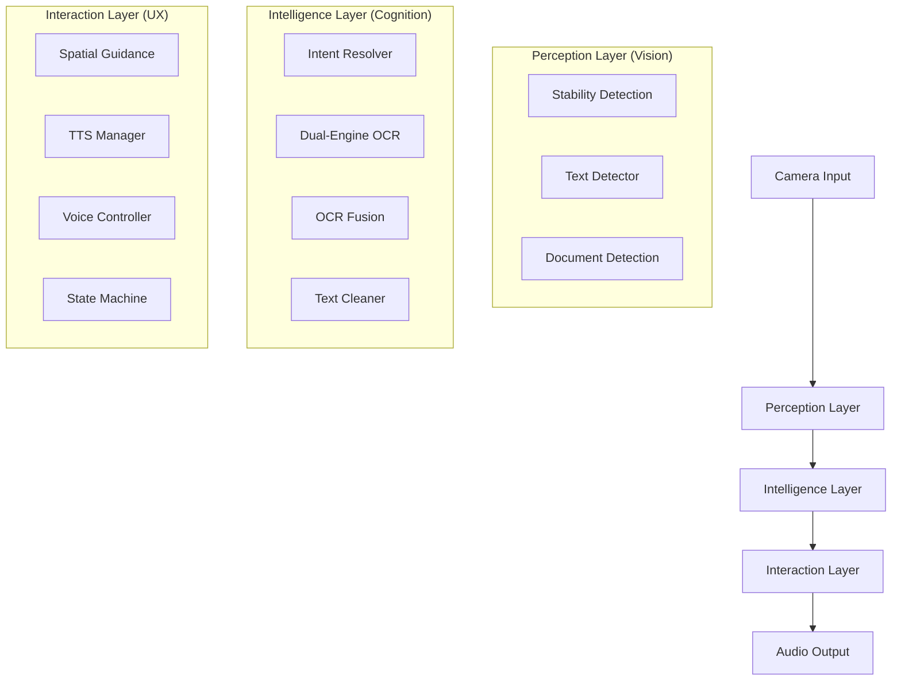

# Wearable AI Reading Cap 👓📖

[](https://www.python.org/downloads/)
[](https://opencv.org/)
[](https://github.com/PaddlePaddle/PaddleOCR)
[](https://opensource.org/licenses/MIT)

An advanced, computer vision-based assistive system designed to help visually impaired individuals read printed text. By combining high-performance OCR engines with intelligent scene understanding and spatial guidance, the system provides a seamless "point-and-read" experience.

---

## 🌟 Key Features

-   **🚀 Dual-Engine OCR Pipeline**: Utilizes **PaddleOCR** as the primary engine for industry-leading accuracy, with **EasyOCR** as a robust fallback.
-   **👁️ Intelligent Scene Understanding**:
    *   **Stability Detection**: Optical flow-based analysis ensures captures only happen when the camera is steady.
    *   **Document Detection**: Automatic page boundary identification and perspective correction (deskewing).
    *   **Region of Interest (ROI)**: Focuses processing on detected text areas to optimize performance.
-   **🧠 Smart Processing**:
    *   **Temporal OCR Fusion**: Combines results from multiple frames to eliminate "glitchy" reads caused by lighting or motion.
    *   **Advanced Preprocessing**: CLAHE, denoising, and adaptive thresholding for clear extraction even in low light.
-   **🗣️ Human-Centric Interaction**:
    *   **Spatial Guidance**: Real-time audio cues (e.g., "Move left," "Centered") to help users align the camera.
    *   **Threaded TTS**: Non-blocking text-to-speech using `pyttsx3` with native macOS/Windows fallbacks.
    *   **Voice Control**: Hands-free operation via voice commands like "Capture," "Stop," and "Repeat."
-   **🔄 Hybrid Modes**:
    *   **Trigger Mode**: High-accuracy burst capture on command.
    *   **Continuous Mode**: Hands-free scanning with automatic reading and deduplication.

---

## 🏗️ System Architecture

The system follows a modular, three-layer architecture to ensure hardware portability and maintainability.



---

## 📂 Project Structure

```text
wearable-updated/
├── camera/             # Camera ingestion & hardware interface
├── perception/         # Computer Vision (Stability, Detection, ROI)
├── intelligence/       # OCR Engine, Fusion logic, & Text Processing
├── interaction/        # TTS, Voice Control, & Guidance Systems
├── utils/              # Logging & system-wide utilities
├── main.py             # System entry point & main event loop
├── config.py           # Global parameters & tunable thresholds
└── requirements.txt    # Project dependencies
```

---

## 🛠️ Installation & Setup

### 1. Prerequisites
- Python 3.9 or higher
- A webcam or external camera module

### 2. Clone the Repository
```bash
git clone https://github.com/jsharma9992/wearable-updated.git
cd wearable-updated
```

### 3. Install Dependencies
```bash
pip install -r requirements.txt
```
> **Note:** PaddleOCR may require additional setup depending on your OS (e.g., `paddlepaddle` or `paddlepaddle-gpu`).

### 4. Configuration
Adjust system thresholds, camera index, and OCR preferences in `config.py`:
```python
CAMERA_INDEX = 0               # Device index
OCR_PRIMARY = "paddle"         # "paddle" or "easyocr"
STABILITY_THRESHOLD = 2.0      # Lower = stricter stability
```

### 5. Run
```bash
python main.py
```

---

## 📈 Roadmap & Current Status

-   [x] **Dual OCR Integration**: PaddleOCR (Primary) + EasyOCR (Fallback).
-   [x] **Advanced Preprocessing**: Deskewing and contrast enhancement.
-   [x] **Temporal Fusion**: Improved reliability across frame bursts.
-   [x] **Spatial Guidance**: Audio-based alignment assistance.
-   [x] **Voice Control**: Basic command integration.
-   [ ] **Currency Detection**: Specialized module for banknote identification (In Progress).
-   [ ] **Hardware Portability**: Full optimization for Raspberry Pi 5.
-   [ ] **Hand Tracking**: Interactive "point-at-word" reading via MediaPipe.

---

## 📄 License

This project is licensed under the MIT License - see the [LICENSE](LICENSE) file for details.

---

**Developed for the Wearable AI Reading Project.** Helping the world see through sound. 🔊✨
