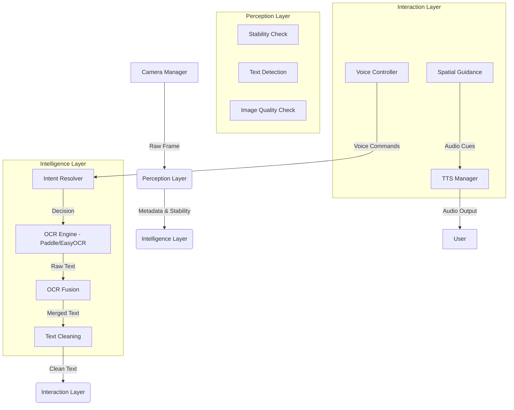

# Wearable AI Reading Cap - System Documentation

Welcome to the comprehensive documentation for the **Wearable AI Reading Cap**. This project is a production-grade assistive technology pipeline designed to help visually impaired users read printed text through a camera-to-voice interface.

---

## 1. Project Overview

The Wearable AI Reading Cap transforms visual information into audible speech. It is built on a modular architecture that separates raw data ingestion (Camera), scene understanding (Perception), decision making (Intelligence), and user feedback (Interaction).

### Key Features:
- **Dual-Mode Operation**: Trigger-based (on command) and Continuous (automatic) reading.
- **Hybrid OCR Pipeline**: High-performance **PaddleOCR** as primary, with **EasyOCR** as a robust fallback.
- **Intelligent Preprocessing**: Automatic denoising, contrast enhancement (CLAHE), and deskewing.
- **Stability Guard**: Optical flow analysis ensures captures only happen when the device is steady.
- **Voice Control**: Hands-free operation via spoken commands.
- **Spatial Guidance**: Audio cues to help users center the text in the camera's view.

---

## 2. Project Structure

The codebase is organized into modular packages to ensure maintainability and hardware abstraction.

```text
wearable-updated/
├── camera/                  # INGESTION LAYER
│   ├── camera_manager.py      # Abstracted OpenCV camera handling
│   └── multi_shot_capture.py  # Logic for burst-mode high-quality capture
├── perception/              # VISION LAYER (Low-level CV)
│   ├── stability.py           # Optical flow-based motion analysis (Lucas-Kanade)
│   ├── text_detector.py       # Detects Regions of Interest (ROI) for text
│   ├── document_detector.py   # Page boundary & perspective detection
│   ├── image_quality.py       # Blur, brightness, and contrast evaluation
│   └── finger_tracker.py      # MediaPipe-based fingertip tracking (Experimental)
├── intelligence/            # COGNITION LAYER (High-level logic)
│   ├── intent_resolver.py     # Main decision engine; resolves system state
│   ├── ocr_engine.py          # Preprocessing + Hybrid OCR (Paddle/EasyOCR)
│   ├── ocr_fusion.py          # Temporal fusion of text results across frames
│   ├── currency_detector.py   # Specialized banknote identification
│   └── text_cleaner.py        # Regex-based post-processing for natural TTS
├── interaction/             # FEEDBACK LAYER (UX)
│   ├── tts_manager.py         # Threaded, non-blocking text-to-speech
│   ├── voice_controller.py    # Speech-to-command recognition
│   ├── guidance.py            # Spatial positioning audio cues (e.g., "Move Left")
│   └── state_machine.py       # Global system state & transition management
├── config.py                # Global parameters & tunable thresholds
├── main.py                  # Entry point & high-frequency event loop
└── requirements.txt         # Dependency manifest
```

---

## 3. Working Architecture (Pipeline Flow)

The following diagram illustrates how a raw camera frame is processed through the system to become spoken words.



---

## 4. Core Logic & Implementation

### A. Stability Detection (Lucas-Kanade)
The system uses the `StabilityDetector` to prevent blurred OCR. It tracks features between consecutive frames using **Lucas-Kanade Optical Flow**. If the average movement (displacement) exceeds a `STABILITY_THRESHOLD`, the system pauses OCR and provides feedback to the user to "hold steady."

### B. Hybrid OCR Pipeline
The `OCREngine` is designed for maximum accuracy:
1.  **Preprocessing**: Each image undergoes a series of enhancements (Grayscale → Denoising → CLAHE → Deskewing).
2.  **Primary Engine (PaddleOCR)**: Used for its speed and state-of-the-art accuracy in detecting complex layouts.
3.  **Fallback Engine (EasyOCR)**: If PaddleOCR fails or returns low-confidence results, the system falls back to EasyOCR.
4.  **Reading Order**: The engine groups detected words into lines based on Y-coordinate proximity and sorts them left-to-right to ensure a natural reading experience.

### C. Intent Resolution
The `IntentResolver` acts as the brain. It monitors:
- User voice commands (via `VoiceController`).
- Hardware triggers (buttons/keys).
- Environmental factors (is there text? is it stable?).
It decides whether to enter **Guidance Mode** (helping the user center the document) or **Reading Mode** (performing the full OCR).

### D. Temporal OCR Fusion
In "Trigger Mode," the system captures a burst of frames. `OCRFusion` analyzes the text from all frames in the burst, deduplicates overlapping segments, and picks the highest-confidence tokens to reconstruct a final, error-corrected text string.

---

## 5. Libraries & Technologies Used

| Library | Role | Why we use it |
| :--- | :--- | :--- |
| **OpenCV** | Computer Vision | For frame capture, stability detection, and image manipulation. |
| **PaddleOCR** | Deep Learning OCR | High-performance, production-grade text recognition. |
| **EasyOCR** | Fallback OCR | Robust alternative based on PyTorch for edge cases. |
| **NumPy** | Numerical Computing | High-speed array operations for image processing. |
| **pyttsx3** | Text-to-Speech | Reliable, offline, cross-platform voice synthesis. |
| **SpeechRecognition**| Voice Control | Allows hands-free operation via "Capture" or "Read" commands. |
| **PyTorch** | AI Backend | Underlying engine for EasyOCR and detection models. |

---

## 6. How the Pipeline Works (Step-by-Step)

1.  **Voice Trigger**: User says "Capture".
2.  **Burst Capture**: `MultiShotCapture` takes 3-5 high-resolution frames.
3.  **Quality Check**: `ImageQualityChecker` filters out frames that are too dark or blurred.
4.  **OCR Processing**: `OCREngine` runs in the background (threaded) to extract text.
5.  **Text Sanitization**: `TextCleaner` removes OCR artifacts (e.g., "l" mistaken for "1" in sentences).
6.  **Audio Output**: `TTSManager` reads the text aloud, allowing the user to pause or repeat via voice.

---

## 7. Deployment Strategy

The system is designed to be hardware-agnostic but optimized for **Edge AI**. While developed on Windows/macOS, it includes logic for frame-skipping and lightweight processing, making it ready for deployment on **Raspberry Pi 4/5** or similar wearable hardware.
